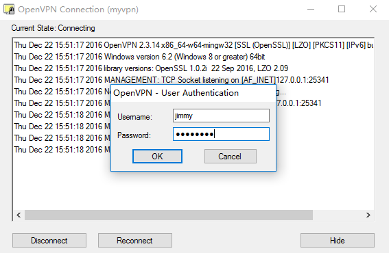

Run openvpn server with docker image `siomiz/softethervpn` in Hyper.sh
======================================================================

# Server

## install dependency
```
$ sudo yum -y install openvpn easy-rsa
```

## generate certificates

> run as root

```
$ find / -name easy-rsa
/usr/share/easy-rsa

$ cd /usr/share/easy-rsa/2.0
$ vim vars
export KEY_COUNTRY="CN"
export KEY_PROVINCE="BJ"
export KEY_CITY="Beijing"
export KEY_ORG="Hypersh"
export KEY_EMAIL="jimmy@hyper.sh"
export KEY_OU="hyper.sh"


$ source ./vars
NOTE: If you run ./clean-all, I will be doing a rm -rf on /usr/share/easy-rsa/2.0/keys

$ rm -rf /usr/share/easy-rsa/2.0/keys

$ ./clean-all

------------------------------------------
//generate ca.crt and ca.key
$ ./build-ca

//generate server.crt and server.key
$ ./build-key-server server

//generate myvpn.crt and myvpn.key
$ ./build-key myvpn

$ ll keys/{ca,server,myvpn}.{crt,key}
-rw-r--r-- 1 root root 1688 Dec 22 15:30 keys/ca.crt
-rw------- 1 root root 1704 Dec 22 15:30 keys/ca.key
-rw-r--r-- 1 root root 5291 Dec 22 15:31 keys/myvpn.crt
-rw------- 1 root root 1708 Dec 22 15:31 keys/myvpn.key
-rw-r--r-- 1 root root 5414 Dec 22 15:30 keys/server.crt
-rw------- 1 root root 1704 Dec 22 15:30 keys/server.key

------------------------------------------
//[optional]generate dh2048.pem
./build-dh

//[optional]generate ta.key
$ openvpn --genkey --secret keys/ta.key
```

## copy the cert and key

>run as normal user

```
$ mkdir -p ~/openvpn-example/etc && cd ~/openvpn-example/etc
$ sudo cp -R /usr/share/easy-rsa/2.0/keys/{myvpn,server,ca}.{crt,key} .
$ sudo chown ${USER}. *.{crt,key}
```

## generate envlist
```
$ cd ~/openvpn-example/etc
$ docker run --rm siomiz/softethervpn gencert > envlist

//update envlist
$ vi envlist
1. remove `PSK=`` and `USERS=``
2. update `CERT=`` and `KEY=``, replace the value from `server.crt` and `server.key`
```

## run hyper container
```
$ cd ~/openvpn-example/etc
$ hyper run -d \
  -p 1194:1194/udp \
  -v $PWD:/opt/chain_certs \
  --name myopenvpn \
  --env-file=${PWD}/envlist \
  -e PSK=mypasswd -e USERNAME=jimmy -e PASSWORD=mypasswd \
  siomiz/softethervpn

$ FIP=$(hyper fip allocate 1)
$ hyper fip attach $FIP myopenvpn
```

# Client

## CentOS

> use openvpn client

### config
```
$ cd ~/openvpn-example/etc

//generate *.ovpn
$ hyper logs myopenvpn > myvpn.ovpn

//update myvpn.ovpn
$ sed -i "s/^remote .*/remote ${FIP} 1194/g" myvpn.ovpn
```

### start connect vpn

> $ sudo openvpn --config myvpn.ovpn

```
Thu Dec 22 15:10:49 2016 OpenVPN 2.3.11 x86_64-redhat-linux-gnu [SSL (OpenSSL)] [LZO] [EPOLL] [PKCS11] [MH] [IPv6] built on May 10 2016
Thu Dec 22 15:10:49 2016 library versions: OpenSSL 1.0.1e-fips 11 Feb 2013, LZO 2.06
Enter Auth Username: *****
Enter Auth Password: ********
Thu Dec 22 15:10:59 2016 WARNING: No server certificate verification method has been enabled.  See http://openvpn.net/howto.html#mitm for more info.
Thu Dec 22 15:10:59 2016 Socket Buffers: R=[212992->212992] S=[212992->212992]
Thu Dec 22 15:10:59 2016 UDPv4 link local: [undef]
Thu Dec 22 15:10:59 2016 UDPv4 link remote: [AF_INET]209.177.90.208:1194
Thu Dec 22 15:10:59 2016 TLS: Initial packet from [AF_INET]209.177.90.208:1194, sid=98bc2b22 4ec8f8ee
Thu Dec 22 15:10:59 2016 WARNING: this configuration may cache passwords in memory -- use the auth-nocache option to prevent this
Thu Dec 22 15:10:59 2016 VERIFY OK: depth=1, C=CN, ST=BJ, L=Beijing, O=Hypersh, OU=HyperHQ, CN=Hypersh CA, name=EasyRSA, emailAddress=jimmy@hyper.sh
Thu Dec 22 15:10:59 2016 VERIFY OK: depth=0, C=CN, ST=BJ, L=Beijing, O=Hypersh, OU=HyperHQ, CN=server, name=EasyRSA, emailAddress=jimmy@hyper.sh
Thu Dec 22 15:10:59 2016 Data Channel Encrypt: Cipher 'AES-256-CBC' initialized with 256 bit key
Thu Dec 22 15:10:59 2016 Data Channel Encrypt: Using 160 bit message hash 'SHA1' for HMAC authentication
Thu Dec 22 15:10:59 2016 Data Channel Decrypt: Cipher 'AES-256-CBC' initialized with 256 bit key
Thu Dec 22 15:10:59 2016 Data Channel Decrypt: Using 160 bit message hash 'SHA1' for HMAC authentication
Thu Dec 22 15:10:59 2016 Control Channel: TLSv1.2, cipher TLSv1/SSLv3 ECDHE-RSA-AES256-GCM-SHA384, 2048 bit RSA
Thu Dec 22 15:10:59 2016 [server] Peer Connection Initiated with [AF_INET]209.177.90.208:1194
Thu Dec 22 15:11:02 2016 SENT CONTROL [server]: 'PUSH_REQUEST' (status=1)
Thu Dec 22 15:11:03 2016 PUSH: Received control message: 'PUSH_REPLY,ping 3,ping-restart 10,ifconfig 192.168.30.13 192.168.30.14,dhcp-option DNS 192.168.30.1,route-gateway 192.168.30.14,redirect-gateway def1'
Thu Dec 22 15:11:03 2016 OPTIONS IMPORT: timers and/or timeouts modified
Thu Dec 22 15:11:03 2016 OPTIONS IMPORT: --ifconfig/up options modified
Thu Dec 22 15:11:03 2016 OPTIONS IMPORT: route options modified
Thu Dec 22 15:11:03 2016 OPTIONS IMPORT: route-related options modified
Thu Dec 22 15:11:03 2016 OPTIONS IMPORT: --ip-win32 and/or --dhcp-option options modified
Thu Dec 22 15:11:03 2016 ROUTE_GATEWAY 192.168.1.1/255.255.255.0 IFACE=wlp2s0 HWADDR=f4:06:69:0c:f2:88
Thu Dec 22 15:11:03 2016 TUN/TAP device tun0 opened
Thu Dec 22 15:11:03 2016 TUN/TAP TX queue length set to 100
Thu Dec 22 15:11:03 2016 do_ifconfig, tt->ipv6=0, tt->did_ifconfig_ipv6_setup=0
Thu Dec 22 15:11:03 2016 /usr/sbin/ip link set dev tun0 up mtu 1500
Thu Dec 22 15:11:03 2016 /usr/sbin/ip addr add dev tun0 local 192.168.30.13 peer 192.168.30.14
Thu Dec 22 15:11:03 2016 /usr/sbin/ip route add 209.177.90.208/32 via 192.168.1.1
Thu Dec 22 15:11:03 2016 /usr/sbin/ip route add 0.0.0.0/1 via 192.168.30.14
Thu Dec 22 15:11:03 2016 /usr/sbin/ip route add 128.0.0.0/1 via 192.168.30.14
Thu Dec 22 15:11:03 2016 Initialization Sequence Completed
```

### test vpn in linux
```
$ hyper inspect --format='{{.NetworkSettings.IPAddress}}' myopenvpn
172.16.0.21

//ping private ip from localhost
$ ping -c1 172.16.0.21
PING 172.16.0.21 (172.16.0.21) 56(84) bytes of data.
64 bytes from 172.16.0.21: icmp_seq=1 ttl=63 time=201 ms
```

## Windows

> use openvpn windows client

### install openvpn windows client
```
//download and install from https://openvpn.net/index.php/open-source/downloads.html
```

### config
```
//for example, openvpn client installed to : D:\Program Files\OpenVPN
//copy myvpn.key, myvpn.key and myvpn.ovpn to D:\Program Files\OpenVPN\config
```

### start connect vpn

> run `OpenVPN GUI` as Administrator





### test vpn in windows
```
PS C:\Users\xjimmy> ping 172.16.0.22

正在 Ping 172.16.0.22 具有 32 字节的数据:
来自 172.16.0.22 的回复: 字节=32 时间=166ms TTL=63
来自 172.16.0.22 的回复: 字节=32 时间=168ms TTL=63
来自 172.16.0.22 的回复: 字节=32 时间=166ms TTL=63
来自 172.16.0.22 的回复: 字节=32 时间=167ms TTL=63
```
